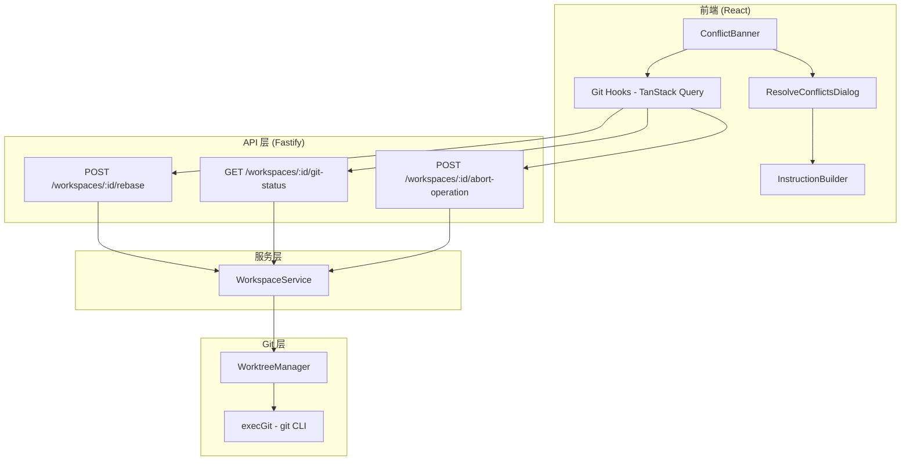

# 设计文档：高级 Git 操作

## 概述

本设计为 Agent Tower 添加高级 Git 操作能力，包括 rebase、增强冲突检测、操作状态查询、冲突解决 UI 和 AI 辅助冲突解决。设计遵循现有架构模式：服务端采用 Fastify + Prisma + WorktreeManager 分层架构，前端采用 React + TanStack Query + shadcn/ui 组件体系。

核心设计决策：
- **Rebase 策略**：采用 `git rebase --onto` 方式，通过 merge-base 计算精确的 rebase 起点，与 vibe-kanban 参考实现一致
- **冲突检测**：扩展现有 MergeConflictError，增加 conflictOp 字段标识冲突来源
- **状态检测**：通过检测 Git 内部状态文件（rebase-merge、rebase-apply、MERGE_HEAD）判断操作状态，无需额外数据库字段
- **前端冲突流程**：ConflictBanner → ResolveConflictsDialog → AI 指令生成/手动解决

## 架构



数据流：
1. 前端通过 TanStack Query hooks 调用 API
2. API 路由层做参数校验，委托给 WorkspaceService
3. WorkspaceService 协调 WorktreeManager 和数据库操作
4. WorktreeManager 通过 execGit 执行 git CLI 命令
5. 冲突发生时，错误沿调用链向上传播，API 层转换为 409 响应
6. 前端收到冲突响应后展示 ConflictBanner

## 组件与接口

### 1. WorktreeManager 扩展（packages/server/src/git/worktree.manager.ts）

新增方法：

```typescript
/**
 * Rebase 任务分支到新的基础分支上
 * 使用 git rebase --onto <newBase> <mergeBase> <taskBranch>
 */
async rebase(worktreePath: string, baseBranch: string): Promise<void>

/**
 * 获取当前 Git 操作状态
 * 检测 rebase-merge/rebase-apply 目录和 MERGE_HEAD 文件
 */
async getGitOperationStatus(worktreePath: string, baseBranch: string): Promise<GitOperationStatus>

/**
 * 中止当前进行中的 Git 操作（rebase 或 merge）
 * 如果没有进行中的操作，则为 no-op
 */
async abortOperation(worktreePath: string): Promise<void>

/**
 * 检测 rebase 是否正在进行
 * 通过 git rev-parse --git-path 获取 rebase-merge/rebase-apply 路径并检查是否存在
 */
private async isRebaseInProgress(worktreePath: string): Promise<boolean>

/**
 * 检测 merge 是否正在进行
 * 通过 git rev-parse --verify MERGE_HEAD 判断
 */
private async isMergeInProgress(worktreePath: string): Promise<boolean>
```

### 2. 新增错误类型（packages/server/src/git/git-cli.ts）

```typescript
export class RebaseInProgressError extends GitError {
  constructor() {
    super('Rebase in progress; resolve or abort it before retrying', 'REBASE_IN_PROGRESS');
    this.name = 'RebaseInProgressError';
  }
}
```

扩展 MergeConflictError：
```typescript
export class MergeConflictError extends GitError {
  conflictedFiles: string[];
  conflictOp: ConflictOp;

  constructor(conflictedFiles: string[], conflictOp: ConflictOp) {
    const fileList = conflictedFiles.join(', ');
    super(`Merge conflict in files: ${fileList}`, 'MERGE_CONFLICT');
    this.name = 'MergeConflictError';
    this.conflictedFiles = conflictedFiles;
    this.conflictOp = conflictOp;
  }
}
```

### 3. WorkspaceService 扩展（packages/server/src/services/workspace.service.ts）

新增方法：

```typescript
async rebase(id: string): Promise<void>
async getGitStatus(id: string): Promise<GitOperationStatus>
async abortOperation(id: string): Promise<void>
```

每个方法负责：查找 workspace → 获取 project 信息 → 委托给 WorktreeManager → 处理错误

### 4. API 路由扩展（packages/server/src/routes/workspaces.ts）

新增端点：

| 方法 | 路径 | 描述 | 成功状态码 | 冲突状态码 |
|------|------|------|-----------|-----------|
| POST | `/workspaces/:id/rebase` | 执行 rebase | 200 | 409 |
| GET | `/workspaces/:id/git-status` | 查询 Git 状态 | 200 | - |
| POST | `/workspaces/:id/abort-operation` | 中止操作 | 200 | - |

冲突响应格式：
```json
{
  "error": "Merge conflict in files: ...",
  "code": "MERGE_CONFLICT",
  "conflictedFiles": ["src/index.ts", "src/utils.ts"],
  "conflictOp": "REBASE"
}
```

### 5. 前端 Hooks（packages/web/src/hooks/use-workspaces.ts）

新增 hooks：

```typescript
export function useGitStatus(workspaceId: string)
  // useQuery, queryKey: queryKeys.workspaces.gitStatus(id)

export function useRebaseWorkspace()
  // useMutation, POST /workspaces/:id/rebase

export function useAbortOperation()
  // useMutation, POST /workspaces/:id/abort-operation
```

### 6. ConflictBanner 组件（packages/web/src/components/workspace/ConflictBanner.tsx）

Props：
```typescript
interface ConflictBannerProps {
  workspaceId: string;
  gitStatus: GitOperationStatus;
  onResolve: () => void;
}
```

行为：
- 当 `gitStatus.operation === 'idle'` 或 `gitStatus.conflictedFiles.length === 0` 时不渲染
- 展示冲突操作类型标签、冲突文件数量
- 提供"中止操作"和"解决冲突"两个按钮
- 中止操作后自动刷新 git-status 查询

### 7. ResolveConflictsDialog 组件（packages/web/src/components/workspace/ResolveConflictsDialog.tsx）

Props：
```typescript
interface ResolveConflictsDialogProps {
  open: boolean;
  onOpenChange: (open: boolean) => void;
  workspaceId: string;
  conflictOp: ConflictOp;
  conflictedFiles: string[];
  sourceBranch: string;
  targetBranch: string;
  sessions: Session[];
}
```

行为：
- 展示冲突文件列表
- 提供两种解决方式：AI 辅助（选择 Session 发送指令）和手动（在 IDE 中打开）
- AI 辅助模式：调用 InstructionBuilder 生成指令 → 通过 useSendMessage 发送到选定 Session
- 手动模式：调用 useOpenInEditor 打开工作空间

### 8. InstructionBuilder（packages/web/src/lib/conflict-instructions.ts）

```typescript
export function buildResolveConflictsInstructions(
  sourceBranch: string,
  targetBranch: string,
  conflictedFiles: string[],
  conflictOp: ConflictOp
): string
```

生成格式化的冲突解决指令文本，包含：
- 冲突上下文描述（操作类型、分支信息）
- 冲突文件列表
- 根据操作类型的具体解决步骤（rebase → `git rebase --continue`，merge → `git add` + `git commit`）

## 数据模型

### 共享类型（packages/shared/src/types.ts）

```typescript
/** 冲突操作类型 */
export enum ConflictOp {
  REBASE = 'REBASE',
  MERGE = 'MERGE',
}

/** Git 操作状态 */
export interface GitOperationStatus {
  /** 当前操作类型 */
  operation: 'idle' | 'rebase' | 'merge';
  /** 冲突文件列表 */
  conflictedFiles: string[];
  /** 冲突操作类型（仅在有冲突时有值） */
  conflictOp: ConflictOp | null;
  /** 分支分歧信息 */
  ahead: number;
  behind: number;
}
```

### API 响应类型

```typescript
/** Rebase 成功响应 */
interface RebaseResponse {
  success: true;
}

/** 冲突错误响应 */
interface ConflictErrorResponse {
  error: string;
  code: 'MERGE_CONFLICT';
  conflictedFiles: string[];
  conflictOp: ConflictOp;
}

/** 中止操作响应 */
interface AbortOperationResponse {
  success: true;
}
```

### 数据库

本设计不需要修改 Prisma schema。Git 操作状态通过实时检测 Git 内部文件获取，无需持久化。

</text>
</invoke>

## 正确性属性

*属性（Property）是指在系统所有有效执行中都应成立的特征或行为——本质上是关于系统应该做什么的形式化陈述。属性是人类可读规范与机器可验证正确性保证之间的桥梁。*

### Property 1: Rebase 产生正确的线性历史

*For any* 仓库，其中任务分支从旧的基础分支分叉出来，且基础分支已经前进，执行 rebase 后，任务分支的所有独有提交应该位于新基础分支的 HEAD 之上，且任务分支的 merge-base 与新基础分支应该等于新基础分支的 HEAD。

**Validates: Requirements 1.1**

### Property 2: 冲突错误包含正确的文件列表和操作类型

*For any* 会产生冲突的 rebase 或 merge 操作，抛出的 MergeConflictError 应包含非空的 conflictedFiles 数组（每个元素对应一个实际冲突的文件），且 conflictOp 字段应正确反映操作类型（rebase 操作为 REBASE，merge 操作为 MERGE）。

**Validates: Requirements 1.3, 4.1, 4.2, 4.3**

### Property 3: 失败的 rebase 自动清理

*For any* 因非冲突原因失败的 rebase 操作，操作完成后 worktree 中不应存在 rebase-merge 或 rebase-apply 目录，即仓库应恢复到干净状态。

**Validates: Requirements 1.5**

### Property 4: Git 操作状态检测准确性

*For any* worktree，getGitOperationStatus 返回的操作类型应与 Git 内部状态一致：当 rebase-merge 或 rebase-apply 目录存在时报告 'rebase'，当 MERGE_HEAD 存在时报告 'merge'，否则报告 'idle'。当存在进行中的操作时，conflictedFiles 应包含所有 `git diff --name-only --diff-filter=U` 输出的文件。

**Validates: Requirements 2.1, 2.2, 2.3, 2.4**

### Property 5: 中止操作恢复到操作前状态

*For any* 处于 rebase 或 merge 进行中状态的 worktree，执行 abortOperation 后，worktree 的 HEAD 应恢复到操作开始前的提交，且 getGitOperationStatus 应报告 'idle' 状态，conflictedFiles 应为空数组。

**Validates: Requirements 3.1, 3.2, 3.4**

### Property 6: API 冲突响应格式正确性

*For any* 通过 API 触发的产生冲突的 Git 操作，API 响应的 HTTP 状态码应为 409，响应体应包含 conflictedFiles 数组（与实际冲突文件一致）和 conflictOp 字段（与操作类型一致）。

**Validates: Requirements 5.4**

### Property 7: ConflictBanner 渲染正确性

*For any* GitOperationStatus，当 operation 不为 'idle' 且 conflictedFiles 非空时，ConflictBanner 应渲染并包含冲突操作类型标签和冲突文件数量；当 operation 为 'idle' 或 conflictedFiles 为空时，ConflictBanner 不应渲染任何内容。

**Validates: Requirements 6.1, 6.4**

### Property 8: InstructionBuilder 输出完整性

*For any* 有效的冲突操作类型、源分支名、目标分支名和非空冲突文件列表，InstructionBuilder 生成的指令文本应为非空字符串，包含所有冲突文件路径，且当操作类型为 REBASE 时包含 "rebase --continue"，当操作类型为 MERGE 时包含 "git add" 和 "git commit"。

**Validates: Requirements 8.1, 8.2, 8.3, 8.4, 8.5**

### Property 9: GitOperationStatus 序列化 round-trip

*For any* 有效的 GitOperationStatus 对象，执行 `JSON.parse(JSON.stringify(status))` 应产生与原对象深度相等的结果。

**Validates: Requirements 9.2**

## 错误处理

### 服务端错误处理

| 错误类型 | HTTP 状态码 | 触发场景 |
|---------|-----------|---------|
| MergeConflictError | 409 | rebase 或 merge 产生冲突 |
| RebaseInProgressError | 409 | 已有 rebase 进行中时尝试新的 rebase |
| BranchesDivergedError | 400 | 分支分歧（现有行为） |
| WorktreeDirtyError | 400 | worktree 有未提交更改 |
| NotFoundError | 404 | 工作空间不存在 |
| GitError | 400 | 其他 Git 操作错误 |

### 错误处理策略

1. **Rebase 失败自动清理**：非冲突失败时自动执行 `git rebase --abort`
2. **冲突保留现场**：冲突发生时保留 Git 操作状态，允许用户选择解决或中止
3. **中止操作幂等性**：无操作进行中时中止请求为 no-op，不抛出错误
4. **API 层统一转换**：在路由错误处理钩子中将 MergeConflictError 转换为 409 响应，将 RebaseInProgressError 转换为 409 响应

### 前端错误处理

1. **409 响应处理**：TanStack Query 的 onError 回调检测 409 状态码，自动刷新 git-status 查询以更新 ConflictBanner
2. **网络错误**：显示 toast 通知，不改变 UI 状态
3. **乐观更新回滚**：中止操作使用 TanStack Query 的 onError 回滚机制

## 测试策略

### 单元测试

- **WorktreeManager 方法测试**：使用真实 Git 仓库（临时目录），测试 rebase、getGitOperationStatus、abortOperation 的具体场景
- **InstructionBuilder 测试**：测试各种冲突场景下的指令生成
- **错误类型测试**：验证 MergeConflictError、RebaseInProgressError 的结构

### 属性测试

- 使用 **fast-check** 作为属性测试库（TypeScript 生态中最成熟的 PBT 库）
- 每个属性测试至少运行 100 次迭代
- 每个测试用注释标注对应的设计属性编号
- 标注格式：**Feature: git-operations, Property {number}: {property_text}**

### 测试分层

| 层级 | 测试类型 | 覆盖范围 |
|------|---------|---------|
| Git 层 | 单元测试 + 属性测试 | WorktreeManager 的 rebase、状态检测、中止操作 |
| 服务层 | 单元测试 | WorkspaceService 的协调逻辑 |
| API 层 | 集成测试 | 端点响应格式、状态码、错误处理 |
| 前端纯函数 | 属性测试 | InstructionBuilder 输出完整性 |
| 前端组件 | 单元测试 | ConflictBanner 渲染逻辑、ResolveConflictsDialog 交互 |
| 共享类型 | 属性测试 | GitOperationStatus round-trip 序列化 |
